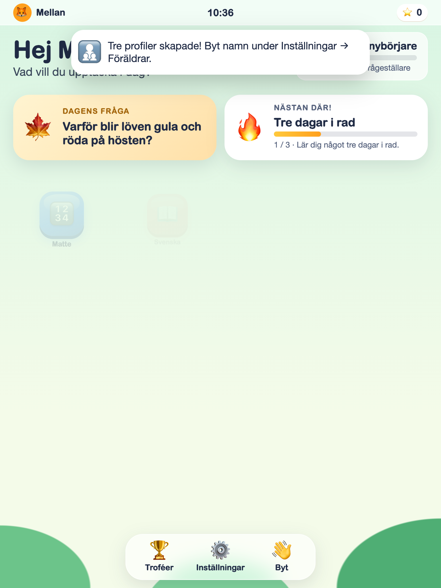
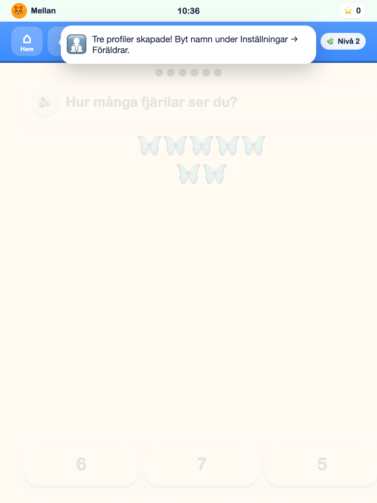
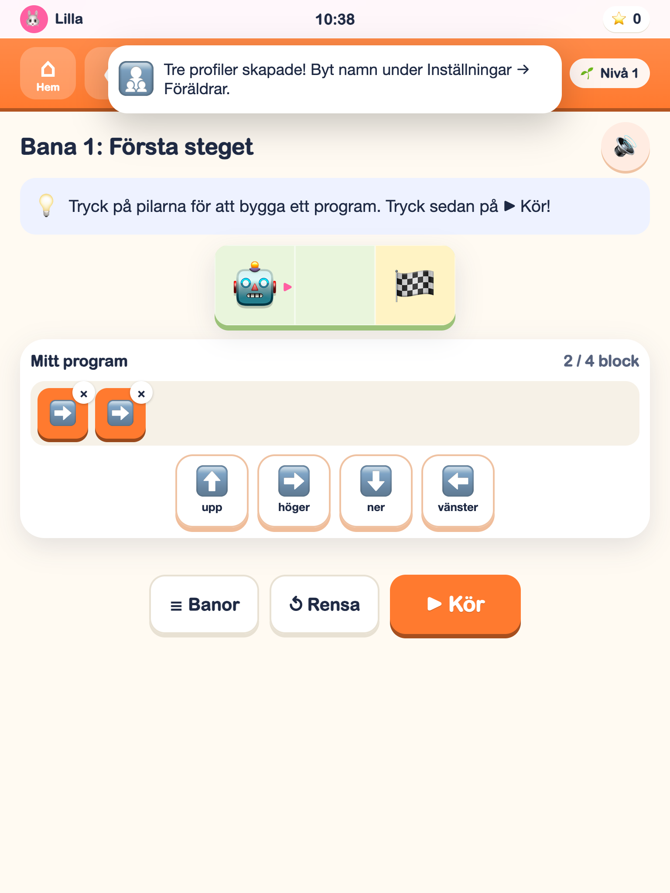
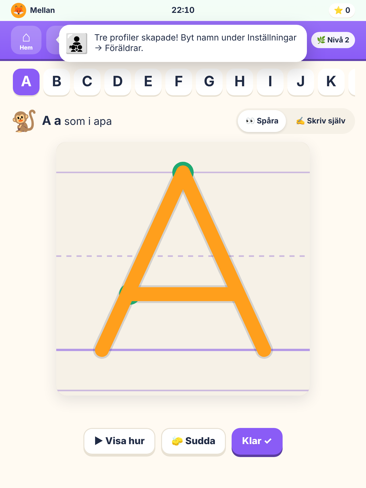

# KidsOS

**Ett lärande "operativsystem" för barn 4–12 år – byggt för iPad och mobil.**

KidsOS ser ut och känns som ett eget operativsystem: varje barn har en egen profil på låsskärmen, en hemskärm med appar och en docka, och appar som öppnas i egna fönster. Varje app är ett ämne att fördjupa sig i. Allt är byggt för att väcka **nyfikenhet**, **kreativitet** och **lärande** – med grundläggande innehåll kopplat till Skolverkets läroplan (Lgr22) för förskoleklass och årskurs 1–3. AI och fördjupad kodning kompletterar dessa färdigheter.

| Hemskärm | Frågerunda | Robotbanan | Skriv ABC |
|---|---|---|---|
|  |  |  |  |

## Innehåll

| App | Vad barnet gör |
|---|---|
| 🔢 **Matte** | 17 moduler: räkna, störst/minst, mönster, former (2D och 3D), tiokompisar, plus/minus med tioramar, talföljder, klockan (läsa *och* ställa in visarna), hemliga talet (likhetstecknet), dubbelt/hälften, mäta med linjal, diagram, tiotal/ental med tiobasmaterial, gånger/delat, chans (sannolikhet), vardagsproblem samt lika delar och bråk. |
| 📖 **Svenska** | Bokstavsljud, rimma, klappa stavelser på en trumma, första ljudet, stor/liten bokstav, bygga ord, läsa och välja bild, ABC-ordning, bygga meningar och skiljetecken, motsatser/synonymer, Ord i vardagen, Textens ledtrådar och 14 originalberättelser från lyssnande till läsning mellan raderna – med textstöd och förklaringar. |
| ✏️ **Skriv ABC** | Spåra stora och små bokstäver (alla 29), siffror, ord och *sitt eget namn* med fingret. Startpunkter, riktningspilar och en animerad "Visa hur". Bedömningen tål darriga barnhänder men inte klotter. |
| 🔬 **Vetenskap** | Experiment med arbetsgången Fråga → Gissa → Testa → Förklara: flyter/sjunker, magneten, ljus & skugga, vattnets former (smälta, koka, kondensera, frysa), gungbrädan (jämvikt), rutschkanan (friktion), blanda & separera (filtrera/avdunsta) och källsortering med pant. Resultaten sparas i ett protokoll. Tre övningar med 30 scenarier tränar observationer, krafter och att ta vara på saker. |
| 🌿 **Biologi** | Utforska kroppen (utsida och organ), "var är …?", sinnena, årstider, livscykler, 25 svenska artkort att samla, djurgrupper, näringskedjor och må bra (sömn, hygien, mat, vänner). |
| 🚀 **Rymden** | Ett levande solsystem att trycka på, bygg och räkna ner en raket, dag & natt i Göteborg, månens faser, planetordning, stjärnbilder att rita (med gamla berättelser), varför vi har årstider, och ett rymdquiz. |
| 🧠 **AI** | 10 lektioner och 42 scenarier om AI, data, modeller, faktakontroll, rättvisa, tydliga instruktioner och privatliv. Träna en enkel modell med riktiga djurfoton och testa på andra djur. |
| 🤖 **Kodning** | Sex lektioner och 30 frågor om instruktioner, felsökning, loopar, villkor, variabler och händelser/funktioner. Dessutom: 20 robotbanor i tre kapitel (pilar → sväng & kör → loopar), följ koden, programmerade saker i vardagen, och rita med kod (sköldpaddsgrafik). |
| 🌍 **Världen** | Världsdelar, djur, platser, Sverigekartan, väderstreck, historia, högtider och barns rättigheter. |
| 🏡 **Lekstaden** | Utforska en leksaksstad, bygg, blanda färger och använd mynt som tjänas genom lärandet. |
| 🎨 **Rita** | Penslar, stämplar, spegelpensel (symmetri), ångra och ett eget galleri – plus ritidéer som väcker fantasin. |
| 🤔 **Undra** | 40 stora frågor ("Varför är himlen blå?") där barnet gissar först, får ett svar och en följdfråga att fundera vidare på. En nivåanpassad fråga varje dag på hemskärmen. Nya kort har korta svar för yngre och fördjupning för äldre. |
| 🏆 **Troféer** | 54 troféer, titlar från "Nyfiken nybörjare" till "Universumets mästare" och samlingar (artkort, planeter, stjärnbilder, bokstäver). |
| ⚙️ **Inställningar** | Barnets egna val (figur, bakgrund, uppläsning) och en föräldradel bakom spärr: profiler, nivåer, skärmtid, synliga appar, föräldrakod, rapport mot läroplanen och säkerhetskopia. |

Hela kopplingen till läroplanen, modul för modul, finns i [docs/LARANDE.md](docs/LARANDE.md). Forskningen bakom designen finns i [docs/RESEARCH.md](docs/RESEARCH.md). Föräldraguiden finns i [docs/FORALDRAR.md](docs/FORALDRAR.md).

## Byggt för barn

- **Stora tryckytor:** allt är minst 56 punkter, svarsknappar 88 punkter. Testerna underkänner allt under 44.
- **Förlåtande touch:** dubbeltryck filtreras bort, knappar har en osynlig extra marginal och allt som kan dras kan också tryckas.
- **Uppläsning på svenska:** för barn upp till 7 år läses frågor, alternativ och förklaringar upp automatiskt. Äldre barn trycker på 🔊. På iPad används den inbyggda svenska rösten.
- **Anpassad nivå:** fem rätt i rad ger en svårare nivå, tre missar i rad en lättare.
- **Inga straff:** fel ger tips, efter två försök visas svaret med en förklaring. Stjärnor och troféer kan aldrig förloras.
- **Inga annonser och ingen data som lämnar enheten.**

## Kom igång

Ingen installation behövs för barnen – KidsOS är en enda HTML-fil.

**På iPad eller mobil**
1. Öppna länken till den publicerade versionen i Safari.
2. Tryck på dela-knappen → **Lägg till på hemskärmen**. Då öppnas KidsOS i helskärm som en egen app.
3. Skapa en profil per barn (en vuxen gör det). Snabbstarten skapar tre syskon (5, 7 och 9 år) som du sedan kan byta namn på.

**Från datorn (samma wifi)**
```bash
npm install
npm run build
npm run serve     # skriver ut en adress, t.ex. http://192.168.1.20:8080, att öppna på iPaden
```

Framstegen sparas i webbläsaren på respektive enhet. Under Inställningar → Föräldrar → Säkerhetskopia kan du flytta framsteg mellan enheter.

## För utvecklare

```bash
npm install
npm run build      # bygger dist/index.html (fristående) och dist/artifact.html
npm run dev        # bygger om vid ändringar
npm test           # enhetstester + bygg + end-to-end-tester
npm run docs       # genererar docs/LARANDE.md från koden
```

End-to-end-testerna använder Chromium. Sätt `CHROME_PATH` om den inte hittas automatiskt.

### Struktur

```
src/
  main.js               start
  core/                 ren logik utan DOM (testbar i Node)
    model.js            profiler, nivåanpassning, rundor, dagar i rad, skärmtid
    trophies.js         troféer och framsteg
    progress.js         titlar
    age.js              nivåer och åldrar
    curriculum.js       Lgr22-citat
    storage.js          lagring med reservläge i minnet + säkerhetskopia
    speech.js, sound.js uppläsning och syntetiserade ljud
  apps/                 innehåll och frågegeneratorer per ämne
    math.js svenska.js letters.js science.js biology.js space.js code.js wonder.js draw.js
    registry.js         alla appar i hemskärmens ordning
  ui/
    shell.js            låsskärm, hemskärm, docka, fönster, föräldraspärr, paus
    quiz.js             frågemotorn (8 frågetyper)
    visuals.js          SVG-illustrationer som rena funktioner
    trophyroom.js settings.js
    views/              interaktiva vyer (spårning, robot, experiment, rymden …)
  styles/app.css
scripts/                build, serve, docs
tests/unit/             Node-tester (bl.a. tusentals genererade frågor per modul)
tests/e2e/              Playwright-tester med pekskärm på iPad- och mobilskärm
```

### Lägga till innehåll

**En ny frågemodul** är en funktion som får `(nivå 0–4, rng)` och returnerar en fråga:

```js
export function genMinModul(level, rng) {
  const a = rng.int(1, 5 + level * 5);
  return {
    type: 'choice',                 // choice | numpad | order | sort | build | tapcount | tap | clock
    prompt: `Vad är ${a} + 1?`,
    options: [{ id: String(a + 1), label: String(a + 1) }, { id: String(a), label: String(a) }],
    answer: String(a + 1),
    hint: 'Räkna ett steg till.',
    explain: `${a} + 1 = ${a + 1}.`,
  };
}
```

Registrera den i appens `modules`-lista med `gen`, `minLevel` och `lgr` (läroplanskoder). Enhetstesterna kontrollerar automatiskt att den ger giltiga frågor på alla nivåer.

## Licens

Privat familjeprojekt.

### Fotografier i lärmaterialet

Artkort, djursortering, näringskedjor och solsystemets faktakort använder lokalt
inbäddade referensfotografier där de finns i bildkatalogen. Övriga motiv behåller
sina illustrationer. Fotografierna fungerar utan nätverk och visas utan beskärning.
Källor och licenser finns i appens samlingar och i [bildförteckningen](docs/photo-credits.md).
Efter ändringar av bilderna eller `src/assets/photos/credits.json`, kör
`node scripts/embed-photos.mjs` före bygget.

### AI och Kodning

Kurserna kombinerar uppläsningsbara lektioner med övningar och sparade läsframsteg.
Fördjupningar låses upp efter barnets nivå. Kodning behåller tidigare robotframsteg.
AI-labbet använder en lokal närmaste-granne-modell med öppet redovisade egenskaper,
inte bildtolkning. Barnen kan ändra träningsetiketter och jämföra svar på andra djur.
Inga externa AI-konton eller tjänster behövs. AI-innehållet bygger på
[UNICEF:s riktlinjer](https://www.unicef.org/innocenti/reports/policy-guidance-ai-children) och
[NIST:s generativa AI-profil](https://nvlpubs.nist.gov/nistpubs/ai/NIST.AI.600-1.pdf).
AI-fördjupningen kompletterar de grundläggande färdigheter som kopplas till läroplanen.

### Enkel profilguide

Föräldern öppnar spärren och godkänner ett av fyra åldersintervall: 4–5, 6–7,
8–9 eller 10–12 år. Barnet gör sedan tre enkla steg: namn, figur och utseende.
Intervallen styr startnivå, uppläsning och rundlängd; övningarna anpassas vidare
när barnet lär sig. Bakgrundskorten visar samma skalbara landskap som hemskärmen.

### Datorläge

Det sammanslagna projektet har också datorläge för äldre barn, med skrivbord och flyttbara fönster. Föräldern kan välja surfplatta eller dator under profilens inställningar. Både kursapparna och profilguiden fungerar med dessa val.
